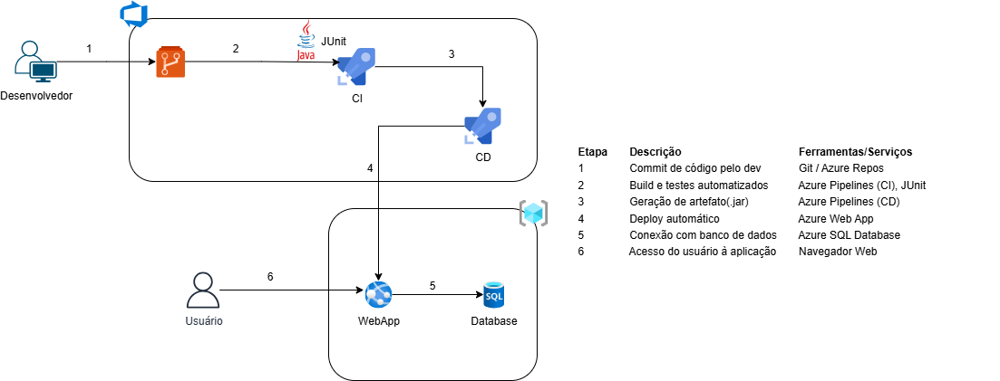

# Tria

## Integrantes do Projeto

| Nome             | RM       |
|------------------|----------|
| Alice Nunes      | 559052   |
| Anne Rezendes    | 556779   |
| Guilherme Akira  | 556128   |

---

## Arquitetura



---

## Link do vídeo

---

## Instruções para Executar

### Pré-requisitos

- Java JDK 17+ instalado
- Git instalado

### Clonando o repositório

```bash
https://github.com/guiakiraa/java-sprint4.git
cd java-sprint4
```

### Configurando o Banco de Dados

Antes de executar o projeto, é necessário configurar a URL do banco de dados no arquivo:

```bash
src/main/resources/application.properties
```

Adicione ou edite as seguintes propriedades conforme o seu ambiente:

```bash
spring.datasource.url=jdbc:mysql://<host>:<porta>/<nome_do_banco>
spring.datasource.username=<usuario>
spring.datasource.password=<senha>
```

### Executando o projeto

Com o Maven Wrapper:

```bash
./mvnw spring-boot:run
```

Agora acesse a aplicação em:

```
http://localhost:8080/
```
